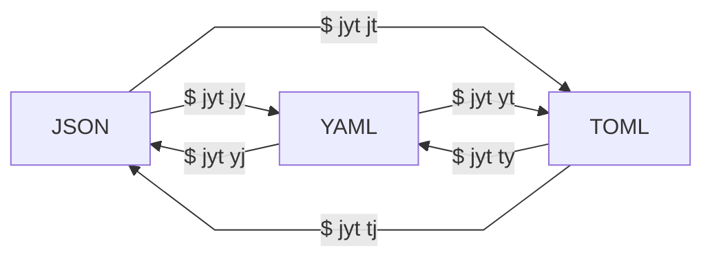

# jyt [](https://crates.io/crates/jyt) [](https://crates.io/crates/jyt)

A tridirectional converter between **J**son, **Y**aml, and **T**oml

## Installation

You can install this using the `cargo install` command:

```bash
$ cargo install jyt
```

## Usage



```bash
$ jyt --help
jyt 0.1.0
A tridirectional converter between Json, Yaml, and Toml

USAGE:
    jyt <SUBCOMMAND>

OPTIONS:
    -h, --help       Print help information
    -V, --version    Print version information

SUBCOMMANDS:
    help            Print this message or the help of the given subcommand(s)
    json-to-toml    Convert Json to Toml (also as `json2toml`, `j2t`, and `jt`)
    json-to-yaml    Convert Json to Yaml (also as `json2yaml`, `j2y`, and `jy`)
    toml-to-json    Convert Toml to Json (also as `toml2json`, `t2j`, and `tj`)
    toml-to-yaml    Convert Toml to Yaml (also as `toml2yaml`, `t2y`, and `ty`)
    yaml-to-json    Convert Yaml to Json (also as `yaml2json`, `y2j`, and `yj`)
    yaml-to-toml    Convert Yaml to Toml (also as `yaml2toml`, `y2t`, and `yt`)
```

## Examples

### JSON -> YAML

```yaml
$ cat ./examples/example.json | jyt json-to-yaml
title: TOML Example
owner:
  name: Tom Preston-Werner
database:
  server: 192.168.1.1
  ports:
  - 8000
  - 8001
  - 8002
  connection_max: 5000
  enabled: true
```

### JSON -> TOML

```bash
$ cat ./examples/example.json | jyt json2toml
title = "TOML Example"

[owner]
name = "Tom Preston-Werner"

[database]
server = "192.168.1.1"
ports = [8000, 8001, 8002]
connection_max = 5000
enabled = true
```

### YAML -> JSON

```bash
$ cat ./examples/example.yaml | jyt y2j
{
  "title": "TOML Example",
  "owner": {
    "name": "Tom Preston-Werner"
  },
  "database": {
    "server": "192.168.1.1",
    "ports": [
      8000,
      8001,
      8002
    ],
    "connection_max": 5000,
    "enabled": true
  }
}
```

### YAML -> TOML

```bash
$ cat ./examples/example.yaml | jyt yt
title = "TOML Example"

[owner]
name = "Tom Preston-Werner"

[database]
server = "192.168.1.1"
ports = [8000, 8001, 8002]
connection_max = 5000
enabled = true
```

### TOML -> JSON

```bash
$ cat ./examples/example.toml | jyt tj
{
  "title": "TOML Example",
  "owner": {
    "name": "Tom Preston-Werner"
  },
  "database": {
    "server": "192.168.1.1",
    "ports": [
      8000,
      8001,
      8002
    ],
    "connection_max": 5000,
    "enabled": true
  }
}
```

### TOML -> YAML

```yaml
$ cat ./examples/example.toml | jyt ty
title: TOML Example
owner:
  name: Tom Preston-Werner
database:
  server: 192.168.1.1
  ports:
  - 8000
  - 8001
  - 8002
  connection_max: 5000
  enabled: true
```

### Advanced Usage

```bash
$ test "$(cat ./examples/example.toml)" = "$(cat ./examples/example.toml | jyt ty | jyt yj | jyt jt)"

$ echo $?
0
```

## Contribution

### Build

```bash
$ cargo build
```

Or you can directly execute the binary:

```bash
$ cargo run
```

### Test

```bash
$ cargo test
```

### Publish

#### [GitHub Releases](https://github.com/ken-matsui/jyt/tags)

```bash
$ git tag v0.1.0
$ git push origin v0.1.0
```

#### [crates.io](https://crates.io/)

```bash
$ cargo publish
```
